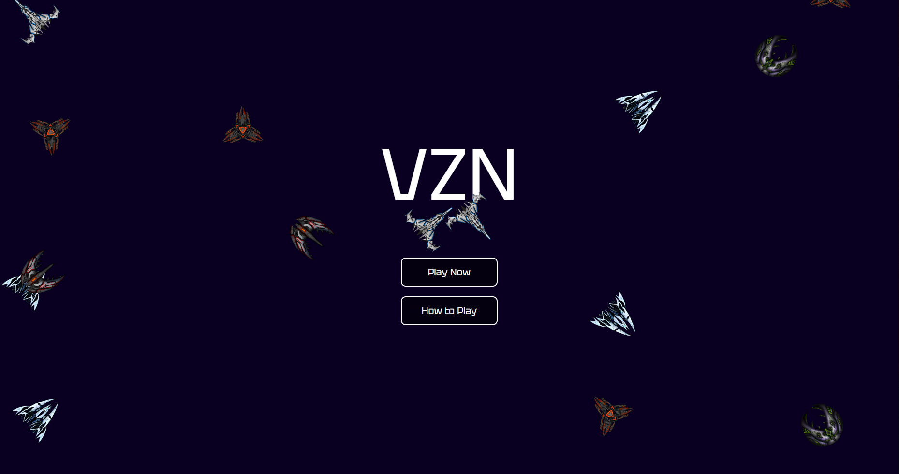
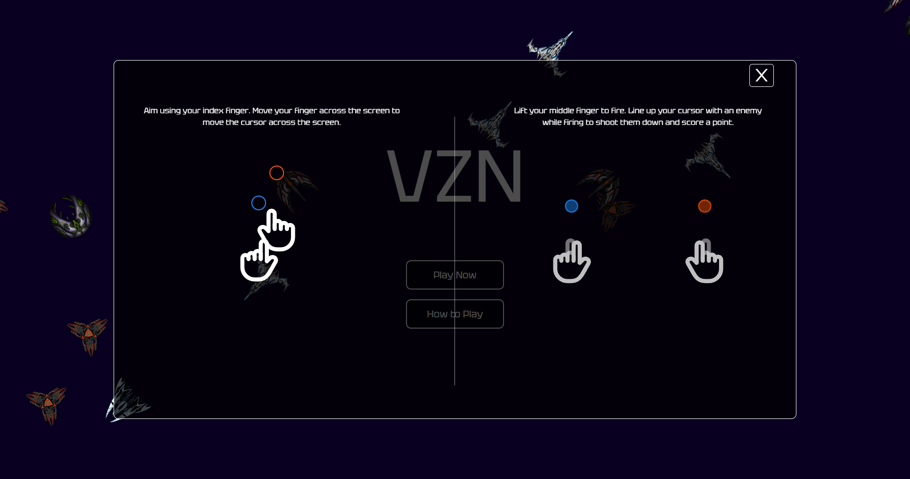
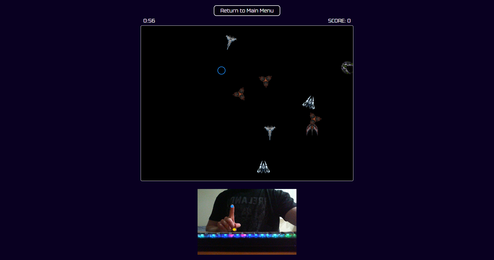

 

    

  

    
    
    
    
    
    
  

    

  ## Overview
  - This project is a proof of concept for a Computer Vision web game. The game itself is a shoot 'em up (SHMUP) that enables the user to fire projectiles using only their hands.
  - Gameplay is facilitated by the [MediaPipe Hand Landmarker](https://developers.google.com/mediapipe/solutions/vision/hand_landmarker) pre-trained machine learning model, made available through the Tensorflow.js library
  - The handtracking functionality was adapted from [this implementation](https://medium.com/@felix.p.lindgren/hand-pose-detection-with-tensorflow-js-and-next-js-b87038c58918) by [Felix Lindgren](https://medium.com/@felix.p.lindgren)
  - This project was also deployed using Vercel (referenced in the stack above), and is available to play at the following address: [https://bghprojects-vzn-v1.vercel.app/](https://bghprojects-vzn-v1.vercel.app/) 

  ## Screenshots

  ### Main Menu
  

    
  ### How To Play
  

  ### Gameplay
  

    
  ### Game Over
  

  
